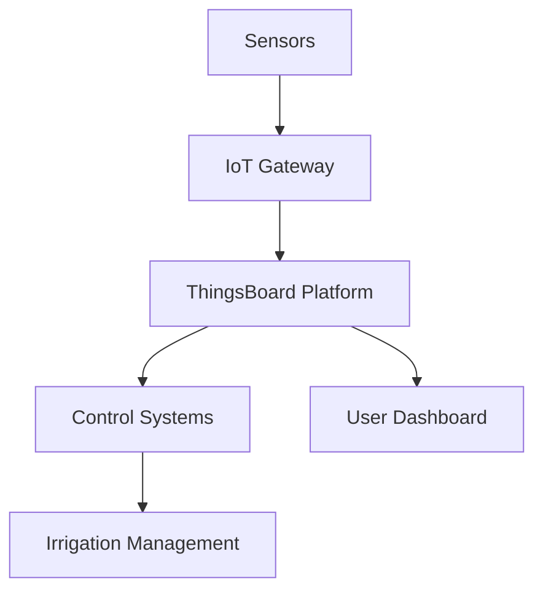
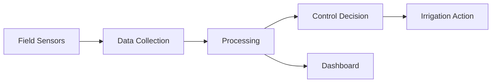
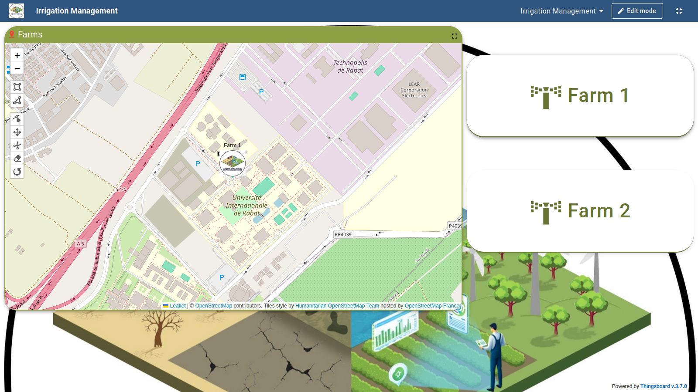
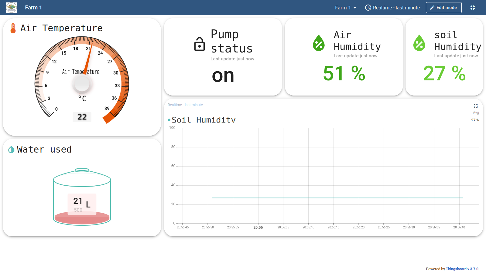
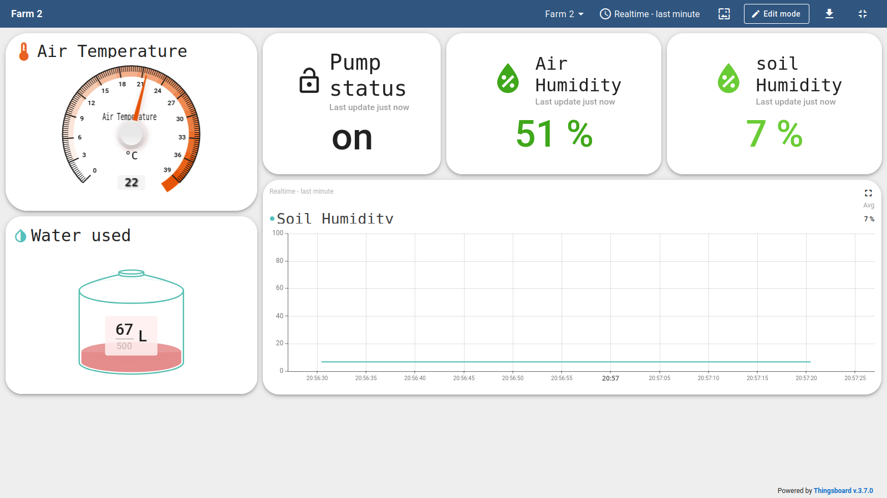
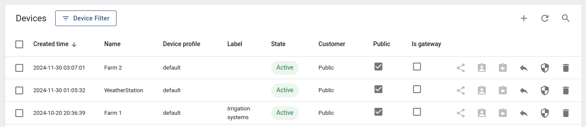

# AQUASHARING: Smart Irrigation Management System 🌱

## Table of Contents
- [Abstract](#abstract)
- [Project Overview](#project-overview)
- [Technical Details](#technical-details)
- [Installation Guide](#installation-guide)
- [Project Documentation](#project-documentation)

---

## Abstract

### 🎯 Background and Problem Statement
Modern agriculture faces critical challenges in water resource management:
- Inefficient traditional irrigation systems
- High water wastage rates
- Lack of real-time monitoring
- Difficulty in managing multiple farm locations
- Absence of data-driven decision making

### 💡 Impact and Proposed Solution
AQUASHARING revolutionizes agricultural water management through:

| Feature | Impact |
|---------|--------|
| AI-Assisted Control | 30% reduction in water usage |
| Real-time Monitoring | Improved crop yield |
| Multi-location Management | Enhanced operational efficiency |
| Predictive Analytics | Data-driven decision making |

### 📊 Project Outcomes and Deliverables

**1. Smart Control System**
- Intelligent irrigation scheduling
- Automated pump control
- Machine learning optimization
- Real-time sensor monitoring

**2. Management Platform**
- Multi-farm dashboard
- Geographic tracking
- Device management
- Access control

---

## Project Overview

### 🔧 Core Components



### 🎛️ Control Systems

#### Bang-Bang Controller
```python
class BangBangController:
    def __init__(self, threshold_low, threshold_high):
        self.threshold_low = threshold_low
        self.threshold_high = threshold_high
    
    def control(self, moisture_level):
        if moisture_level < self.threshold_low:
            return "ON"
        elif moisture_level > self.threshold_high:
            return "OFF"
        return "MAINTAIN"
```

#### Q-Learning Implementation
```python
class QLearningController:
    def __init__(self, states, actions, learning_rate=0.1):
        self.q_table = np.zeros((states, actions))
        self.lr = learning_rate
    
    def update(self, state, action, reward, next_state):
        old_value = self.q_table[state, action]
        next_max = np.max(self.q_table[next_state])
        new_value = (1 - self.lr) * old_value + self.lr * (reward + next_max)
        self.q_table[state, action] = new_value
```

---

## Technical Details

### 📡 System Architecture



### 🔄 Data Structure

```json
{
    "timestamp": "2024-01-01 12:00:00",
    "farm_id": "farm1",
    "readings": {
        "moisture": 45.5,
        "temperature": 22.3,
        "humidity": 65.0
    },
    "control": {
        "pump_state": "ON",
        "flow_rate": 2.5
    }
}
```

---

## Installation Guide

### Prerequisites
Soil Moisture Sensor

# System Requirements
Python 3.8+
4GB RAM
Internet connection

# Create virtual environment
python -m venv venv
source venv/bin/activate  # Windows: venv\Scripts\activate

# Install dependencies
pip install -r requirements.txt

### Configuration Steps

1. **Environment Setup**
   ```bash
   cp .env.example .env
   # Edit .env with your credentials
   ```

2. **Database Initialization**
   ```bash
   python scripts/init_db.py
   ```

3. **Start Services**
   ```bash
   python services/control_system.py
   python services/mqtt_client.py
   ```

---

## Project Documentation

### 📊 Dashboard Screenshots

#### Main Interface


#### Farm 1 Monitoring Dashboard


#### Farm 2 Monitoring Dashboard


#### Irrigation Management Overview


### 📈 System Performance

| Metric | Value |
|--------|-------|
| Water Savings | 30% |
| Response Time | <500ms |
| Accuracy | 95% |
| Uptime | 99.9% |

---

*Made with 💚 by the AQUASHARING Team*
